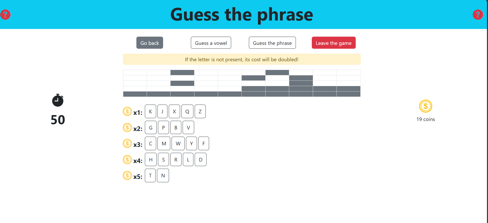

[](https://classroom.github.com/a/4NgFJDM8)
# Exam #3: "Indovina la frase"
## Student: s346140 GULINO CARMELO 

## React Client Application Routes

- Route `/`: renders the home page;
- Route `/login`: contains the login form;
- Route `/users/:userId`: renders the home page with a custom welcome message for the logged user;
- Route `/users/:userId/game/:gameId?`: shows the game content for a logged user. 
The `gameId` parameter is optional because once a user starts a game, they are first redirected 
to `/users/:userId/game` and then to `/users/:userId/game/:gameId` once the `gameId` has been generated;
- Route `/free/game/:gameId?`: same as the previous one, but for users that are not logged in;
- Route `*`: shows the not found page;
- Route with no path: contains the default layout, two sidebars and the main content in the middle.

## API Server

### Game APIs

- POST `/api/games/start`
  - Request parameters: _None_;
  - Request body:  _None_;
  - Response: 
    - `200 OK` for success, with the response body shown below;
    - `403 Forbidden` when the user has zero coins; 
    - `500 Internal Server Error` for a generic error.
  - Response body:
    ```json
    {
      "gameInfo": {
        "game": {
            "gameId": 1,
            "length": 30,
            "blanks": [1, 5, 6],
            "revealed": {},
            "guessedLetters": [],
        },
        "present": null,
        "correct": null,
        "status": "playing",
        "msg": null,
      },
      "letters": ["A", "B", "C"]
    }
    ```

- POST `/api/games/:gameId/letter`
  - Request parameters: `gameId`;
  - Response: 
    - `200 OK` for success, with the response body shown below;
    - `422 Unprocessable Entity` if the user submits more than letter at the same time; 
    - `500 Internal Server Error` for a generic error.
  - Request body:
    ```json
    {
      "letter": "A",
    }
    ```
  - Response body:
    ```json
    {
      "gameInfo": {
        "game": {
            "gameId": 1,
            "length": 30,
            "blanks": [1, 5, 6],
            "revealed": {"2": "A"},
            "guessedLetters": ["A"]
        },
        "present": true,
        "correct": null,
        "status": "playing",
        "msg": "Yes!",
      },
      "user": {
        "id": 1,
        "username": "carmelogulino",
        "coins": 50,
        "game_counter": 3
      }
    }
    ```
    If the letter is not present, the body is the _same_ except for the following:
    ```json
    "present": false,
    "msg": "Nope!"
    ```

- POST `/api/games/:gameId/phrase`
  - Request parameters: `gameId`;
  - Request body:
    ```json
    {
      "phrase": "Mary had a little lamb",
    }
    ```
  - Response: 
    - `200 OK` for success, with the response body shown below;
    - `500 Internal Server Error` for a generic error;
    - `422 Unprocessable Entity` for a validation error. In this case, response body is ` { "msg": "The phrase can ONLY contain letters, both upper and lower case." } `.
  - Response body:
    ```json
    {
      "gameInfo": {
        "game": {
            "gameId": 1,
            "length": 30,
            "blanks": [1, 5, 6],
            "revealed": {"2": "A"},
            "guessedLetters": ["A"]
        },
        "present": null,
        "correct": true,
        "status": "won",
        "msg": null
      },
      "user": {
        "id": 1,
        "username": "carmelogulino",
        "coins": 50,
        "game_counter": 3
      }
    }
    ```
    If the phrase is wrong, the body is the _same_ except for the following:
    ```json
    "correct": false,
    "status": "playing",
    "msg": "The phrase is not correct"
    ```

- DELETE `/api/games/:gameId`
  - Request parameters: `gameId`;
  - Request body:
    ```json
    {
      "gameStatus": "won",
    }
    ```
    It can also contain `{ "gameStatus": "ended" }` or `{ "gameStatus": "timeout" }`.
  - Response: 
    - `200 OK` for success, with the response body shown below;
    - `500 Internal Server Error` for a generic error.
  - Response body:
    ```json
    {
      "user": {
        "id": 1,
        "username": "carmelogulino",
        "coins": 50,
        "game_counter": 3
      },
      "phrase": "Mary had a little lamb"
    }
    ```

### Login APIs

- POST `/api/sessions`
  - Request parameters: _None_;
  - Request body:  _None_;
  - Response: 
    - `201 Created` for success, with the response body shown below.
  - Response body:
    ```json
    {
      "user": {
        "id": 1,
        "username": "carmelogulino",
        "coins": 50,
        "game_counter": 3
      }
    }
    ```
    
- POST `/api/sessions/current`
  - Request parameters: _None_;
  - Request body: _None_;
  - Response: 
    - `200 OK` for success, with the response body shown below;
    - `401 Unauthorized` with `{error: 'Not authenticated'}` in the body.
  - Response body:
    ```json
    {
      "user": {
        "id": 1,
        "username": "carmelogulino",
        "coins": 50,
        "game_counter": 3
      }
    }
    ```

- DELETE `/api/sessions/current`
  - Request parameters: _None_;
  - Request body: _None_;
  - Response: 
    - `200 OK`;
  - Response body: _None_.
  
## Database Tables

- Table `easyPhrases` - contains: `id` (PK), `text`;
- Table `phrases` - contains: `id` (PK), `text`;
- Table `users` - contains: `id` (PK), `username`, `password`, `salt`, `coins`, `game_counter`;
- Table `letters` - contains: `id` (PK), `type`, `symbol`, `cost`;

## Main React Components

-  `App` (in `App.jsx`): it contains the definitions of the main functions used in the app as well as all the routes;
- `DefaultLayout` (in `DefaultLayout.jsx`): it's a container for the content of the whole app and it defines a header
and a single row with three columns;
- `LeftSidebar` (in `LeftSidebar.jsx`): it shows either an icon or the timer during a match;
- `RightSidebar` (in `RightSidebar.jsx`): it shows either an icon or the user's coins during a match;
- `Home` (in `Home.jsx`): it's the main content of the home page and shows a welcome message and information about the 
user's coins, as well as the buttons to play or login;
-  `GameContent` (in `GameContent.jsx`): it's a container for all the components of a game and it defines the function to start a game;
-  `GameGrid` (in `GameGrid.jsx`): it renders a 5x10 grid for the game;
-  `GameActions` (in `GameInputs.jsx`): it shows three buttons to allow the user to choose their next move;
-  `UserInputs` (in `GameInputs.jsx`): it's an orchestrator for what the users sees according to their action 
(a list of consonants, vowels or a form);
-  `LoginForm` (in `AuthComponent.jsx`): it shows the login form and defines the action to manage it;

## Screenshot



## Users Credentials

- carmelogulino, Cgulino28
- mariorossi, Mrossi28
- lucaneri, Lneri28
